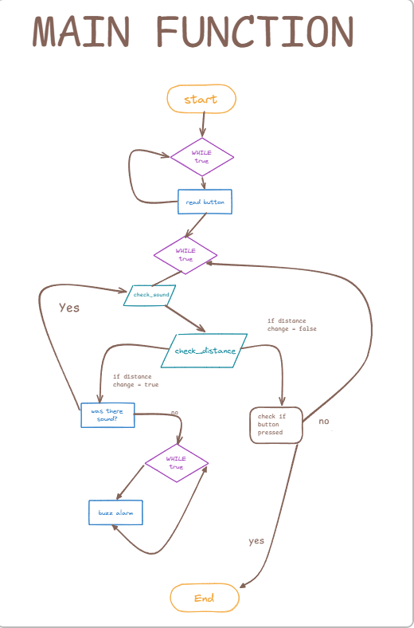

# Project development
## Requirement outline
### Purpose
#### Need
so some people get their house broken into by theives when they are not home and then they get their stuff done snached and getting stuff taken is not good so i wanna make something that will let people will know when their house is being broken into. perchance
#### Solution
what i wanna do is create a thingamagig that can be turned on when leaving home using a button that will start a alarm when a door is opened. i will do this using a ultrasonic sensor the detect the distance of the door and if the distance changes a large enough amount an alarm will sound however this will only happen if the sound level outside is low enough so if you just talk or knock before entering it wont sound . perchance.
### Key actions
1. when a button is pressed the program will begin. perchance.
2. a sound sensor will check for sounds and will display a value of true if the sound is quiet and false if the sound is loud. perchance 
3. a ultrasonic sensor will detect the distance between it and the door. perchance.
4. if the distance sensor detects a large enough change in distance then it will signal the alarm **if** the sound sensor has **not** given a true input in the last 3 seconds else it will end the program. perchance.
5. if the distance detector detected without a sound then the alarm(a buzzer) will sound. perchance.
6. if the button is pressed and held for a bit the program will end
### Functional requirements
1. button input: when button is pressed a while loop that contains the alarm setup will begin. perchance. if the button is pressed and held for a few seconds then the program will end
2. at an undefined interveral the sound sensor will detect weather or not a loud enough sound has occured and if so it will give a value of true
3. if the value of the sound is false then the distance sensor will detect its distance between it and the door and if the value has changed by a large enough ammount then it will tell the alarm to sound
4. when told to the buzzer will begin sounding and making noise
### Test cases
| Test Case | Input     | Expected Output   |
|---------- |---------- |----------------   |
|door is opened with no noise|ultrasonic sensor detects distance change and sound detector detects no sound|buzzer buzzes continuessly|
|door is opened with sound|ultrasonic sensor detects distance change and sound detector detects sound|the buzzer does not buzz|
### Nonfunctional requirements
1. The distance from the door can be changed to allow it to be used for other doors. perchance
## Algorithms
### Main flowchart

### Subroutine Pseudocode
#### Check_sound
if sound sensor detects sound:
    Sound = True
else:
    sound = false
return sound
#### Check_distance
trigger sensor low
utime.sleep 
trigger sensor high
utime sleep 5
trigger sensor low
while echovalue is 0
    signaloff = utime ticks
while echovalue is 1
    signalon = utime ticks
timepassed = signalon - signaloff
distance = (timepassed * 0.0343) / 2
return distance
